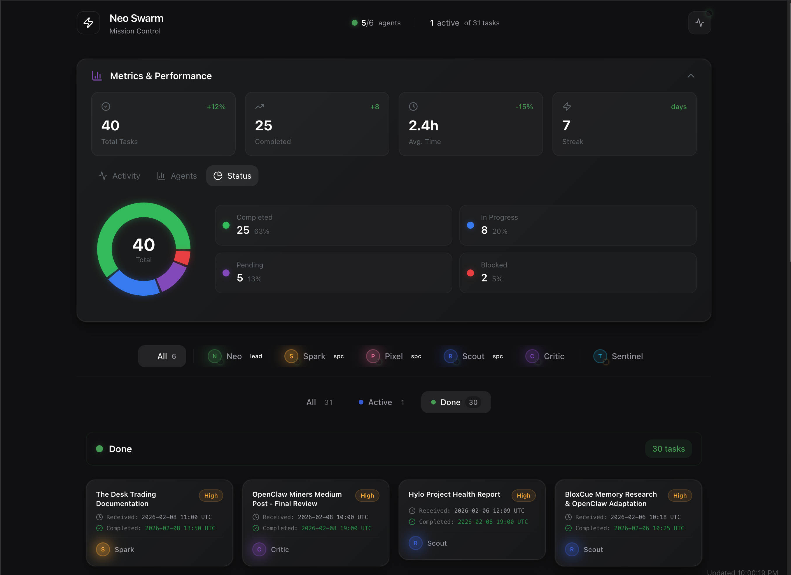

<div align="center">

# OpenClaw Dashboard

<h3>Mission control for your OpenClaw agent swarm.</h3>

<p>
  
  
  
  
  <a href="https://github.com/bokiko/openClaw-dashboard/blob/main/LICENSE">
    
  </a>
</p>

<p>
  <a href="https://openclaw.io">OpenClaw</a> · <a href="https://bokiko.io">bokiko.io</a> · <a href="https://twitter.com/bokiko">@bokiko</a>
</p>

</div>

---



---

## What Is This?

A real-time web dashboard that gives you eyes on your [OpenClaw](https://openclaw.io) agent swarm. It reads task files directly from your swarm's task directory and presents everything in a clean, dark-themed UI.

**No database. No backend setup. Just point it at your tasks folder and go.**

| Feature | What it does |
|---------|--------------|
| **Agent Strip** | See every agent's status at a glance — who's working, who's idle |
| **Kanban Board** | Drag-and-drop tasks across lanes: In Progress, Review, Assigned, Waiting, Inbox, Done |
| **Live Feed** | Real-time activity stream from task changes, auto-refreshes every 30s |
| **Metrics Panel** | Charts and stats — task throughput, status distribution, completion rates |
| **Command Palette** | `Cmd+K` to quickly filter agents, toggle feed, refresh data |
| **Task & Agent Modals** | Click any task or agent for full detail views |

---

## Table of Contents

1. [What Is This?](#what-is-this)
2. [Quick Start](#quick-start)
3. [Configuration](#configuration)
4. [Security](#security)
5. [Task File Format](#task-file-format)
6. [Agent Roster](#agent-roster)
7. [Architecture](#architecture)
8. [Tech Stack](#tech-stack)
9. [Keyboard Shortcuts](#keyboard-shortcuts)
10. [Audit Reports](#audit-reports)
11. [Contributing](#contributing)

---

## Quick Start

### Prerequisites

- Node.js 18+
- An OpenClaw swarm with a tasks directory (JSON files)

### Setup

```bash
git clone https://github.com/bokiko/openClaw-dashboard.git
cd openClaw-dashboard
npm install
```

### Configure your tasks path

Copy `.env.example` to `.env.local` and set `OPENCLAW_TASKS_DIR` to your swarm's task directory:

```bash
cp .env.example .env.local
# Edit .env.local and set OPENCLAW_TASKS_DIR
```

### Run

```bash
npm run dev
```

Open [http://localhost:3000](http://localhost:3000).

---

## Configuration

The dashboard reads JSON task files from a single directory. Set the path via environment variable in `.env.local`:

```bash
OPENCLAW_TASKS_DIR=/path/to/your/tasks
```

If not set, it defaults to `./tasks` relative to the project root.

The dashboard will:
- Scan for all `.json` files in that directory
- Parse each file into a task with status, priority, assignee, and tags
- Auto-refresh every 30 seconds
- Skip files larger than 1MB and validate paths to prevent traversal

---

## Security

### API Key Authentication

For deployments beyond localhost, protect the API with a key:

```bash
# In .env.local
OPENCLAW_API_KEY=your-secret-key
NEXT_PUBLIC_OPENCLAW_API_KEY=your-secret-key
```

When `OPENCLAW_API_KEY` is set, all requests to `/api/data` must include an `Authorization: Bearer <key>` header. If not set, the API remains open (suitable for local development).

### Rate Limiting

The API endpoint includes built-in rate limiting (60 requests per minute per IP). Requests exceeding the limit receive a `429 Too Many Requests` response.

### Path Traversal Protection

Task file loading validates that all resolved file paths stay within the configured tasks directory, preventing directory traversal attacks.

---

## Task File Format

The dashboard is flexible with field names. Drop JSON files into your tasks directory:

```json
{
  "id": "task-001",
  "title": "Implement auth middleware",
  "description": "Add JWT validation to all API routes",
  "status": "in-progress",
  "priority": "high",
  "claimed_by": "spark",
  "tags": ["backend", "security"],
  "created_at": "2025-01-15T10:00:00Z"
}
```

### Status mapping

The dashboard normalizes various status strings:

| Your value | Dashboard shows |
|------------|----------------|
| `complete`, `completed`, `done`, `approved` | Done |
| `in-progress`, `in_progress`, `active`, `working` | In Progress |
| `review`, `submitted`, `pending_review` | Review |
| `assigned`, `claimed` | Assigned |
| `waiting`, `blocked`, `paused` | Waiting |
| anything else | Inbox |

### Priority mapping

| Your value | Dashboard shows |
|------------|----------------|
| `urgent`, `p0`, `critical` | Urgent (red) |
| `high`, `p1` | High (amber) |
| anything else | Normal (grey) |

### Assignee detection

The dashboard checks these fields in order: `claimed_by` → `assignee` → first `deliverables[].assignee`.

---

## Agent Roster

The default agent roster matches the OpenClaw swarm squad. Edit `src/lib/data.ts` to match your agents:

| Agent | Role | Badge |
|-------|------|-------|
| Neo | Squad Lead | Lead |
| Spark | Code & Writing | Specialist |
| Pixel | Design & UI | Specialist |
| Scout | Research | Specialist |
| Critic | Review & QA | — |
| Sentinel | Security | — |

---

## Architecture

```
openClaw-dashboard/
├── audits/                        # Security audit reports
│   └── 2026-02-08-security-audit.md
├── public/
│   └── screenshot.png             # Dashboard screenshot
├── src/
│   ├── app/
│   │   ├── api/data/route.ts      # API endpoint — reads task files from disk
│   │   ├── page.tsx                # Main dashboard page
│   │   ├── layout.tsx              # Root layout, dark theme
│   │   └── globals.css             # Tailwind config, CSS variables
│   ├── components/
│   │   ├── AgentAvatar.tsx         # Agent avatar with status indicator
│   │   ├── AgentModal.tsx          # Agent detail modal
│   │   ├── AgentStrip.tsx          # Horizontal agent status bar
│   │   ├── CommandPalette.tsx      # Cmd+K command palette
│   │   ├── Header.tsx              # Top bar with stats
│   │   ├── LiveFeed.tsx            # Activity feed drawer
│   │   ├── MetricsPanel.tsx        # Charts and statistics
│   │   ├── MissionQueue.tsx        # Kanban board with drag-and-drop
│   │   ├── TaskCard.tsx            # Individual task card
│   │   └── TaskModal.tsx           # Task detail modal
│   ├── lib/
│   │   ├── data.ts                 # Task loader — reads JSON from disk
│   │   ├── useSwarmData.ts         # Client hook — fetches from API, auto-refreshes
│   │   └── utils.ts                # Utility functions
│   └── types/
│       └── index.ts                # TypeScript interfaces and config
├── .env.example                    # Environment variable reference
├── eslint.config.mjs
├── next.config.ts
├── package.json
├── postcss.config.js
├── tailwind.config.js
└── tsconfig.json
```

**Data flow:** Task JSON files on disk → `data.ts` reads them → `/api/data` serves them → `useSwarmData` hook fetches every 30s → React components render.

---

## Tech Stack

| Layer | Technology |
|-------|-----------|
| Framework | Next.js 16 (App Router) |
| UI | React 19, Tailwind CSS 3.4 |
| Animations | Framer Motion |
| Charts | Recharts |
| Drag & Drop | dnd-kit |
| Command Palette | cmdk |
| Primitives | Radix UI (Dialog, Tooltip, Dropdown) |
| Notifications | Sonner |
| Icons | Lucide React |

---

## Keyboard Shortcuts

| Shortcut | Action |
|----------|--------|
| `Cmd/Ctrl + K` | Open command palette |
| `Escape` | Close modals, feed drawer |

---

## Audit Reports

We build in the open. No security through obscurity, no hidden vulnerabilities, nothing to cover up. Every audit we run gets published right here in the repo — the findings, the fixes, and the reasoning behind them. If someone finds a flaw, we'd rather the world see how we handled it than pretend it never existed.

This is how trust gets built: not by claiming perfection, but by showing the work.

| Date | Report | Findings | Status |
|------|--------|----------|--------|
| 2026-02-08 | [Security Audit](audits/2026-02-08-security-audit.md) | 7 (1 critical, 2 medium, 4 low) | All remediated |

---

## Contributing

1. Fork the repo
2. Create a feature branch (`git checkout -b feature/my-feature`)
3. Commit your changes
4. Push to the branch
5. Open a Pull Request
